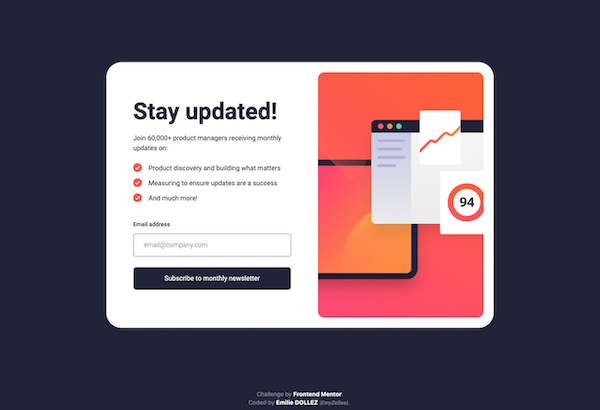
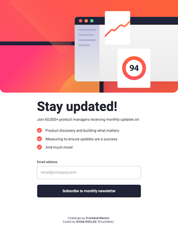
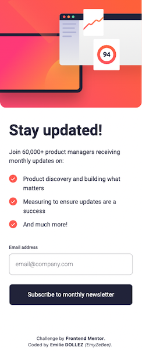
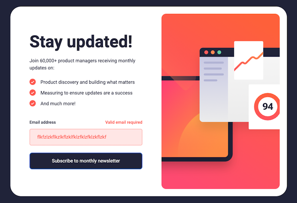
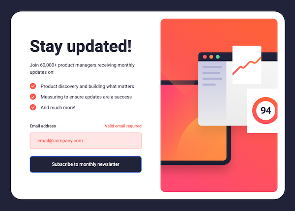
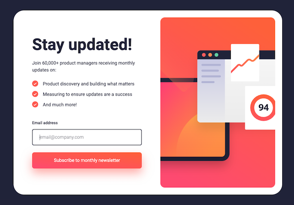
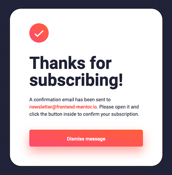
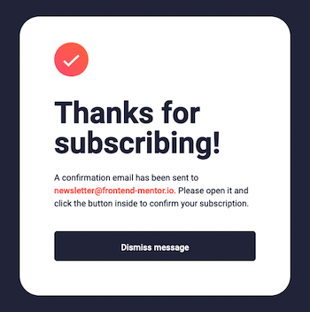
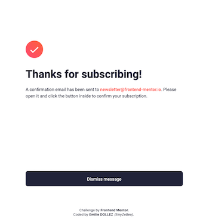
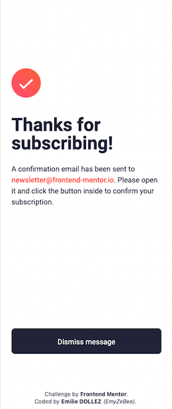

# Frontend Mentor - Newsletter sign-up form with success message solution

Challenge done : August 2, 2023 by Emilie Dollez

This is a solution to the [Newsletter sign-up form with success message challenge on Frontend Mentor](https://www.frontendmentor.io/challenges/newsletter-signup-form-with-success-message-3FC1AZbNrv).  

## Table of contents

- [Overview](#overview)
  - [The challenge](#the-challenge)
  - [Screenshot](#screenshot)
  - [Links](#links)
- [My process](#my-process)
  - [Built with](#built-with)
  - [What I learned](#what-i-learned)
  - [Continued development](#continued-development)
  - [Useful resources](#useful-resources)
- [Author](#author)

## Overview

### The challenge

Users should be able to:

- Add their email and submit the form ✅
- See a success message with their email after successfully submitting the form ✅
- See form validation messages if: 
  - The field is left empty ✅
  - The email address is not formatted correctly ✅
- View the optimal layout for the interface depending on their device's screen size ✅
- See hover and focus states for all interactive elements on the page ✅

### Screenshot

## Newsletter :

## Errors :

## Hover & Focus :

# Success Modal :

### Links  

- Live Solution URL: [https://github.com/EmilieDollez/Newsletter](https://github.com/EmilieDollez/Newsletter)
- Live Site URL: [https://emyzebee-newsletter-frontendmentor.netlify.app/](https://emyzebee-newsletter-frontendmentor.netlify.app/)

## My process

### Built with

- [Tailwind CSS](https://tailwindcss.com/) - I haven't use preformated component, only Tailwind classNames and custom CSS properties
- CSS custom properties
- Flexbox
- [React](https://reactjs.org/) - JS library

### What I learned

I was able to deepen my knowledge of Tailwind CSS classes and work on the use of React's UseStates.
I had started with the Desktop version and I realized that starting with the mobile version is essential. 
It's easier to make elements larger than to shrink them.😅 I will apply this essential rule on my next projects.😜

### Continued development

I would like to rework the project in a few months to optimize my code. 
The idea would be to use Redux to create a Store and make switching from States easier.

### Useful resources

- [Tailwind CSS](https://tailwindcss.com/) - This helped me for XYZ reason. I really liked this pattern and will use it going forward.

## Author

- Frontend Mentor - [@EmilieDollez](https://www.frontendmentor.io/profile/EmilieDollez)
- Linkedin - [@EmilieDollez](www.linkedin.com/in/emilie-dollez-922279a4)

